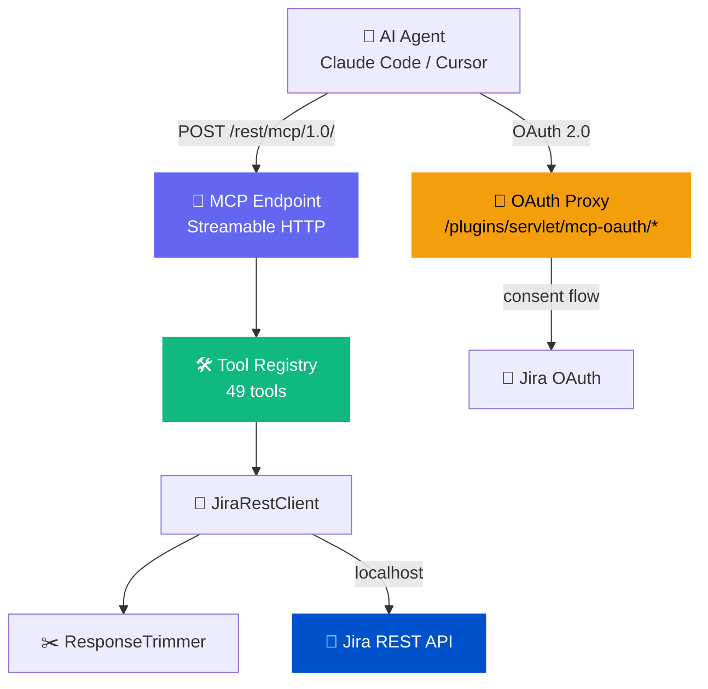
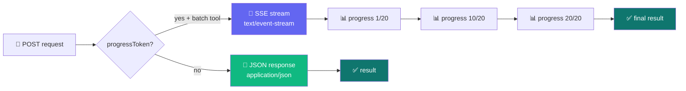
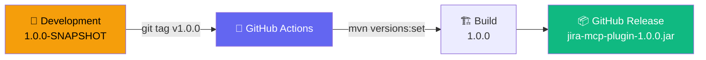

# 🔌 Jira MCP Plugin

> 🏢 Native MCP server for Jira Data Center. AI agents connect directly to your Jira instance.
>
> Repository: `jira-mcp-plugin`

[](https://github.com/mrkhachaturov/jira-mcp-plugin/actions/workflows/build.yml)
[](LICENSE)


[MCP](https://modelcontextprotocol.io/) (Model Context Protocol) server that runs inside your Jira Data Center JVM. Claude Code, Cursor, and other MCP-compatible tools connect to it and work with issues, projects, boards, sprints, and more. Everything stays inside your infrastructure.

| | Scope | Meaning |
|---|-------|---------|
| 🔌 | Plugin | Single JAR, installed via UPM, runs inside the Jira JVM |
| 🔐 | Auth | OAuth 2.0 (browser consent) + Personal Access Tokens |
| 🛠️ | Tools | 49 tools mirrored 1:1 from [mcp-atlassian](https://github.com/sooperset/mcp-atlassian) upstream |
| 📡 | Transport | Streamable HTTP (MCP spec 2025-06-18) with SSE progress streaming |

> [!IMPORTANT]
> This plugin runs entirely inside Jira. No data leaves your infrastructure.
> No sidecars, no proxies, no external API calls. The plugin talks to Jira's own REST API on localhost.

---

## 🗺️ How it works



---

## ⚡ Quick start

```bash
# 1️⃣  Install: download JAR from Releases, upload via UPM
#     Jira Admin > Manage Apps > Upload App

# 2️⃣  Configure OAuth (recommended)
#     Jira Admin > Application Links > Create Link > External Application
#     Name: MCP Server
#     Redirect URL: https://your-jira/plugins/servlet/mcp-oauth/callback
#     Permission: Write
#     Then: MCP Configuration > OAuth tab > paste Client ID and Secret

# 3️⃣  Connect your AI tool
```

```json
{
  "mcpServers": {
    "jira": {
      "type": "http",
      "url": "https://your-jira.example.com/rest/mcp/1.0/"
    }
  }
}
```

On first connection, click Authenticate, consent on the Jira page, and you're in.

---

## 🛠️ Available tools

<details>
<summary>49 tools across 13 categories (click to expand)</summary>

| | Category | Tools | Count |
|---|----------|-------|:-----:|
| 📋 | Issues | `search`, `get_issue`, `get_project_issues`, `create_issue`, `update_issue`, `delete_issue`, `batch_create_issues`, `batch_get_changelogs` | 8 |
| 💬 | Comments | `add_comment`, `edit_comment` | 2 |
| 🔄 | Transitions | `get_transitions`, `transition_issue` | 2 |
| ⏱️ | Worklogs | `get_worklog`, `add_worklog` | 2 |
| 🏃 | Boards and sprints | `get_agile_boards`, `get_board_issues`, `get_sprints_from_board`, `get_sprint_issues`, `create_sprint`, `update_sprint`, `add_issues_to_sprint` | 7 |
| 🔗 | Links | `get_link_types`, `create_issue_link`, `create_remote_issue_link`, `remove_issue_link`, `link_to_epic` | 5 |
| 📁 | Projects | `get_all_projects`, `get_project_versions`, `get_project_components`, `create_version`, `batch_create_versions` | 5 |
| 👤 | Users | `get_user_profile`, `get_issue_watchers`, `add_watcher`, `remove_watcher` | 4 |
| 📎 | Attachments | `download_attachments`, `get_issue_images` | 2 |
| 🏷️ | Fields | `search_fields`, `get_field_options` | 2 |
| 🎫 | Service Desk | `get_service_desk_for_project`, `get_service_desk_queues`, `get_queue_issues` | 3 |
| 📝 | Forms | `get_issue_proforma_forms`, `get_proforma_form_details`, `update_proforma_form_answers` | 3 |
| 📊 | Metrics | `get_issue_dates`, `get_issue_sla`, `get_issue_development_info`, `get_issues_development_info` | 4 |

Tools that require Jira Software, JSM, or Proforma are hidden automatically when those plugins aren't installed.

</details>

---

## 📡 Transport

The plugin implements MCP Streamable HTTP on a single endpoint. The server decides the response format per request.



Most tool calls return plain JSON. Batch tools (`batch_create_issues`, `batch_create_versions`, `batch_get_changelogs`, `get_issues_development_info`) support SSE streaming when the client sends a `progressToken`. The server sends progress notifications as SSE events before the final result.

| | Method | Behavior |
|---|--------|----------|
| 📨 | POST | JSON for single responses, SSE for batch tools with `progressToken` |
| 📡 | GET | SSE stream for server-initiated notifications (requires `MCP-Session-Id`) |
| 🗑️ | DELETE | Close session |

Sessions are tracked via the `MCP-Session-Id` header, assigned on `initialize`.

### SSE event taxonomy

Every SSE event has a globally unique `id` field for reconnection via `Last-Event-ID`.

| | Event type | When | Payload |
|---|-----------|------|---------|
| 💓 | `heartbeat` | Every 30s on GET streams, priming event on connect | Empty data |
| 📊 | `progress` | During batch tool execution | JSON-RPC `notifications/progress` |
| 📨 | `message` | Final tool result | JSON-RPC response with `CallToolResult` |
| ❌ | `error` | Tool execution failure during streaming | Error details |

### Partial failure handling

Batch tools don't fail the entire request when individual operations error. The final result includes both successes and failures:

```json
{
  "created": 18,
  "errors": 2,
  "issues": [ ... ],
  "failed": [
    {"index": 3, "summary": "Issue 4", "error": "Project not found"},
    {"index": 7, "summary": "Issue 8", "error": "Permission denied"}
  ]
}
```

### SSE lifecycle metrics

The server tracks active streams, total events sent, reconnects, and active sessions. Accessible via `McpResource.getSseMetrics()` for monitoring and debugging reverse proxy issues.

---

## 🔐 Authentication

### OAuth 2.0 (recommended) 🌐

The plugin proxies between MCP clients and Jira's built-in OAuth provider. Users click Authenticate, consent in the browser, and the token exchange happens automatically.

```text
🤖 MCP Client → 🔌 Plugin OAuth Proxy → 🦊 Jira OAuth 2.0 → ✅ Consent → 🔑 Token → Done
```

### Personal Access Tokens 🔑

Create a PAT in Jira (Profile > Personal Access Tokens) and configure your MCP client with a Bearer token header.

---

## 🛡️ Enterprise security

The plugin runs inside the Jira JVM. No data leaves your infrastructure. It uses Jira's own OAuth 2.0 and PAT mechanisms, so there are no separate credentials and no API keys to external services. The same Jira permissions apply: users can only access projects and issues they already have access to.

| | Concern | How it's handled |
|---|---------|-----------------|
| 🏠 | Data residency | Runs inside Jira JVM, no outbound connections |
| 🔐 | Authentication | Jira's own OAuth 2.0 and PATs |
| 🔒 | Authorization | Same Jira permissions, same project access |
| 👥 | Admin control | Group and user allowlists, per-tool enable/disable, read-only mode |
| 📋 | Audit trail | All requests go through Jira's standard auth pipeline |
| 🌐 | Origin validation | `Origin` header checked per MCP spec (DNS rebinding protection) |

> [!CAUTION]
> The plugin makes localhost HTTP calls to Jira's own REST API. No outbound network connections are made. Verify this by checking your firewall logs after installation.

---

## ⚙️ Admin configuration

Access via Jira Admin > MCP Server > MCP Configuration.

| | Tab | What |
|---|-----|------|
| ⚙️ | General | Enable/disable MCP, read-only mode, base URL override |
| 👥 | Access Control | Allowed groups + individual users (empty = everyone) |
| 🛠️ | Tools | Click-to-toggle tool list with search filter |
| 🔐 | OAuth | Client ID/Secret, status, callback URL, user config snippet |

---

## ✂️ Response trimming

Jira's REST API returns a lot of data that AI agents don't need: avatar URLs, self links, icon URLs, empty group containers. The plugin strips these before returning results, matching the upstream mcp-atlassian's `to_simplified_dict()` behavior.

Fields stripped recursively: `self`, `avatarUrls`, `iconUrl`, `expand`, `groups`, `applicationRoles`

Fields renamed to match upstream: `issuetype` to `issue_type`, `fixVersions` to `fix_versions`

---

## 📋 Prerequisites

| | Tool | Purpose |
|---|------|---------|
| ☕ | Java 17 | Runtime (via mise) |
| 🧰 | Atlassian Plugin SDK | `atlas-mvn` for local builds |
| ⚡ | `just` | Task runner |
| 🔧 | `mise` | Tool version manager + env var loader |

## 🔨 Building from source

```bash
# 🧰 Setup
mise trust && mise install

# 🏗️ Build
just build

# 🚀 Build + deploy + run 35 e2e tests
just deploy-and-test

# 📋 Or step by step
just deploy              # build + upload to Jira UPM
just e2e                 # run e2e tests against live Jira
just codegen             # regenerate tools from upstream Python definitions
```

---

## 🔄 Release process



Development uses `1.0.0-SNAPSHOT` in pom.xml. When you push a tag like `v1.0.0`, GitHub Actions strips the SNAPSHOT suffix and builds a clean release JAR. The CHANGELOG.md entry for that version is included in the release notes.

---

## 🙏 Credits

Tool definitions are mirrored from [mcp-atlassian](https://github.com/sooperset/mcp-atlassian) by [@sooperset](https://github.com/sooperset). That project is a Python-based MCP server for Atlassian products. This plugin re-implements the same 49 tools as a native Jira plugin so you don't need an external process.

## 📄 License

[MIT](LICENSE)
